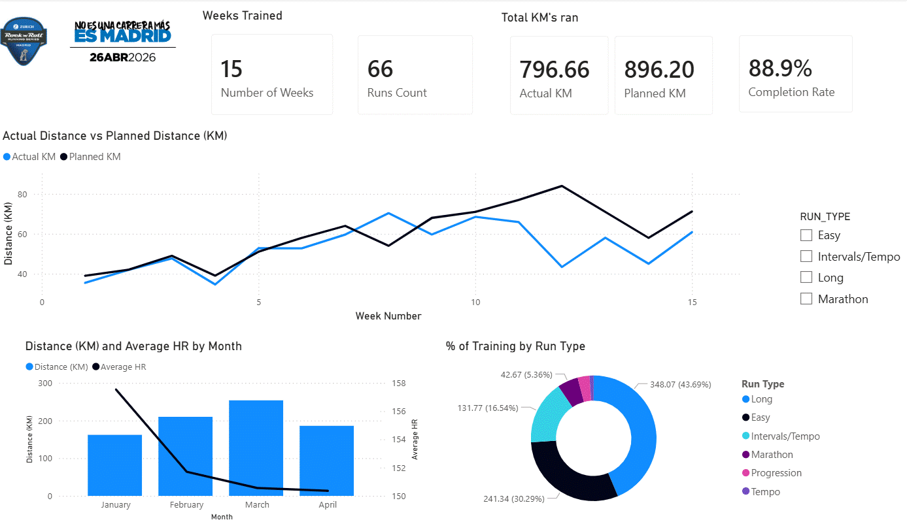
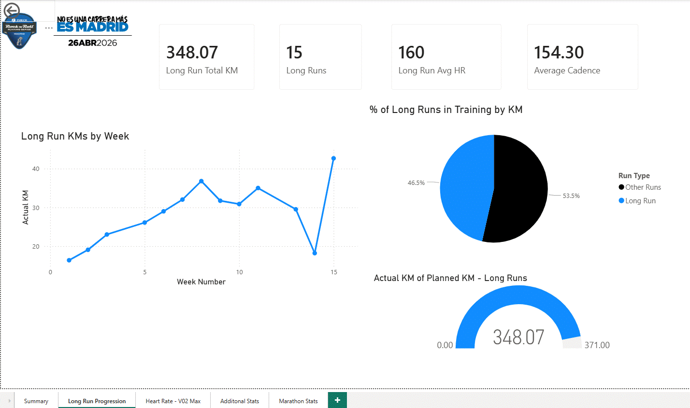
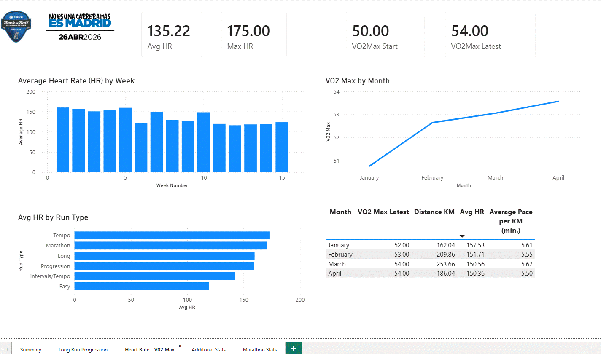
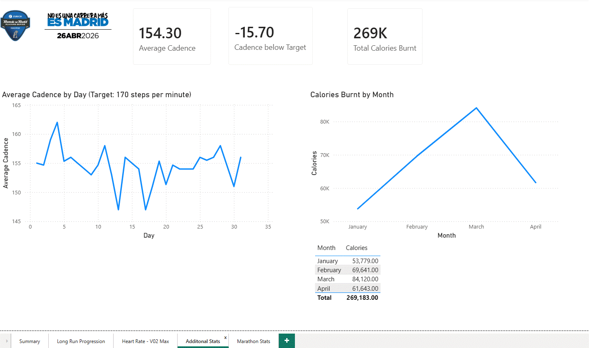
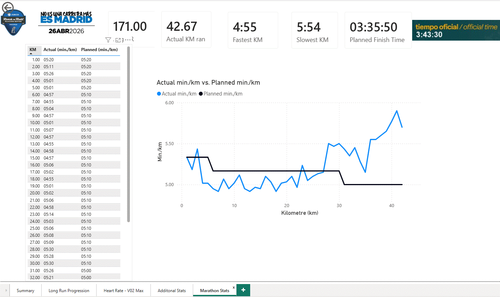

# Madrid Marathon Training Analytics

## Project Overview
End-to-end data analytics project analysing 15 weeks of marathon 
training data leading up to the 2026 Madrid Marathon.

## Tools Used
- **Excel** — Data collection, cleaning and preparation
- **Snowflake** — Cloud data warehouse and SQL analytics
- **Power BI** — Interactive dashboard and visualisation

## Data Sources
- Ben Parkes 15 week intermediate marathon training plan
- Strava GPS activity data exported from personal account
- Garmin race day kilometre splits

## Project Structure
- `/data` — Cleaned CSV files ready for Snowflake import
- `/sql` — All SQL scripts for table creation and analysis
- `/powerbi` — Power BI dashboard file
- `/images` — Dashboard screenshots

## Key Analysis
- Planned vs actual training volume across 15 weeks
- Long run distance progression over the training block
- Heart rate and V02 Max trends over time
- Additional stats like cadence progression and calories burnt 
- Race day km by km pace analysis vs planned pace

## Dashboard
[[View the live Power BI report here]](https://app.powerbi.com/groups/me/reports/99db0e1e-5a68-4fcf-9548-fed5283dffa8/664ff07d7c4309f35b2d?experience=power-bi)

## Key Findings
- Total planned km: 896.2 | Total actual km: 796.66
- Completion rate: 88.9%
- Actual finish time: 3:43:30 | Planned finish time: 3:35:50
